### Escuela Colombiana de Ingeniería
### Arquitecturas de Software - ARSW

## Escalamiento en Azure con Maquinas Virtuales, Sacale Sets y Service Plans

### Dependencias
* Cree una cuenta gratuita dentro de Azure. Para hacerlo puede guiarse de esta [documentación](https://azure.microsoft.com/es-es/free/students/). Al hacerlo usted contará con $100 USD para gastar durante 12 meses.
Antes de iniciar con el laboratorio, revise la siguiente documentación sobre las [Azure Functions](https://www.c-sharpcorner.com/article/an-overview-of-azure-functions/)

### Parte 0 - Entendiendo el escenario de calidad

Adjunto a este laboratorio usted podrá encontrar una aplicación totalmente desarrollada que tiene como objetivo calcular el enésimo valor de la secuencia de Fibonnaci.

**Escalabilidad**
Cuando un conjunto de usuarios consulta un enésimo número (superior a 1000000) de la secuencia de Fibonacci de forma concurrente y el sistema se encuentra bajo condiciones normales de operación, todas las peticiones deben ser respondidas y el consumo de CPU del sistema no puede superar el 70%.

### Escalabilidad Serverless (Functions)

1. Cree una Function App tal cual como se muestra en las  imagenes.

* Creacion de la Function App en Azure

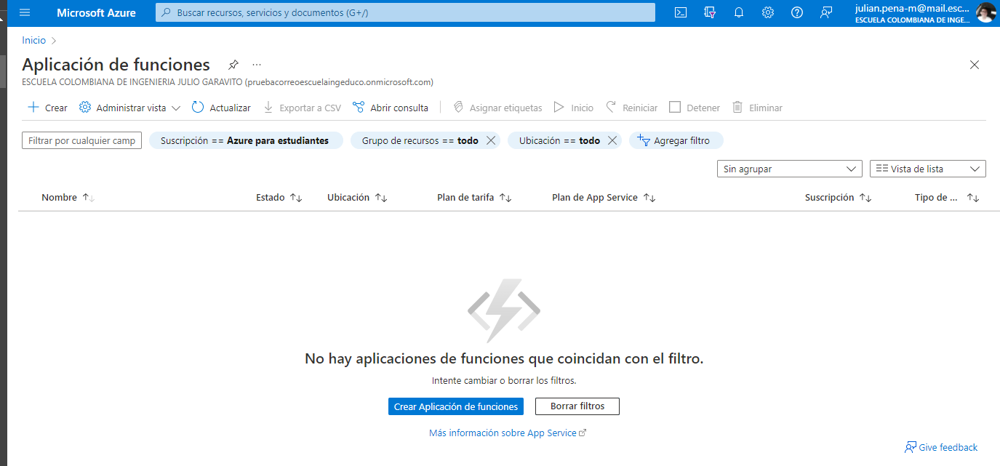

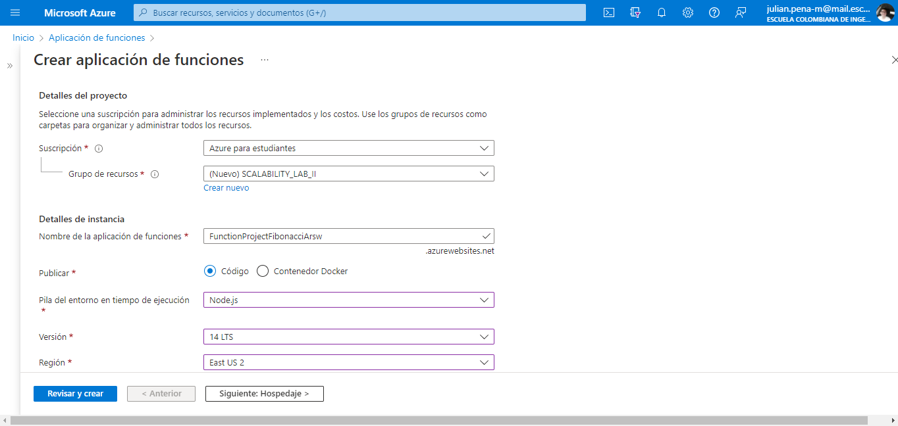

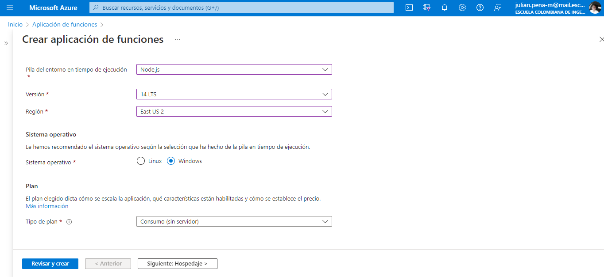

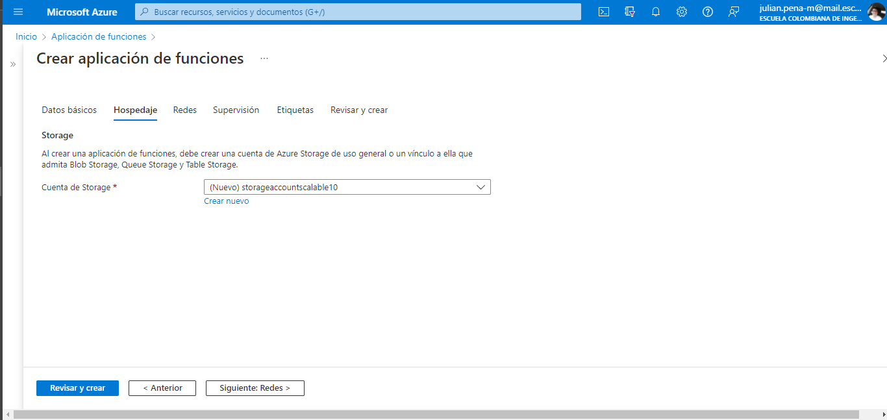

2. Instale la extensión de **Azure Functions** para Visual Studio Code.

* Se instala Azure Functions en Visual Studio Code

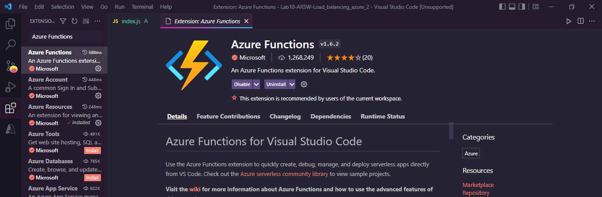

3. Despliegue la Function de Fibonacci a Azure usando Visual Studio Code. La primera vez que lo haga se le va a pedir autenticarse, siga las instrucciones.

* Se realiza el despliegue

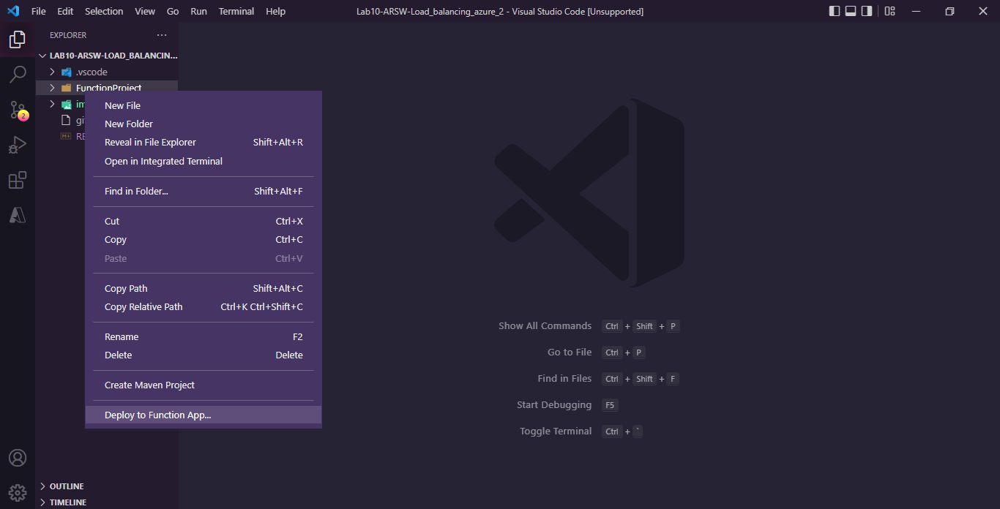

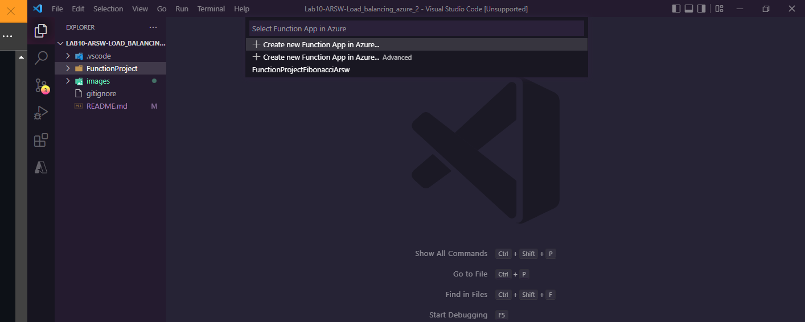

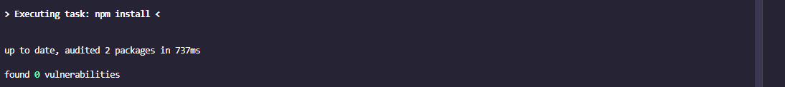

4. Dirijase al portal de Azure y pruebe la function.

* Se verifica el correcto despliegue en azure y el consumo de memoria

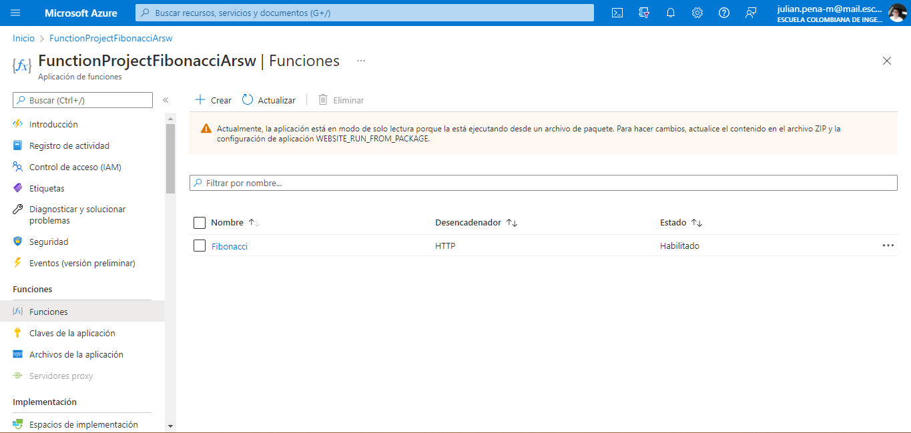

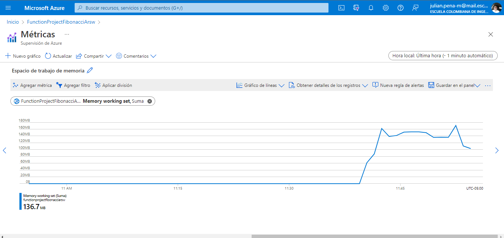

5. Modifique la coleción de POSTMAN con NEWMAN de tal forma que pueda enviar 10 peticiones concurrentes. Verifique los resultados y presente un informe.

* Se modifico la coleccion de postman, de tal manera de que se pueda enviar 10 peticiones concurrentes para hacer la prueba. Quedo de la siguiente forma

  * Functions Collection
  
  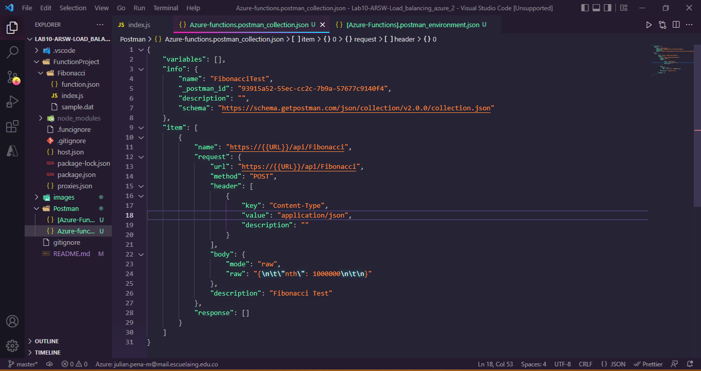
  
  * Functions Enviroment
  
  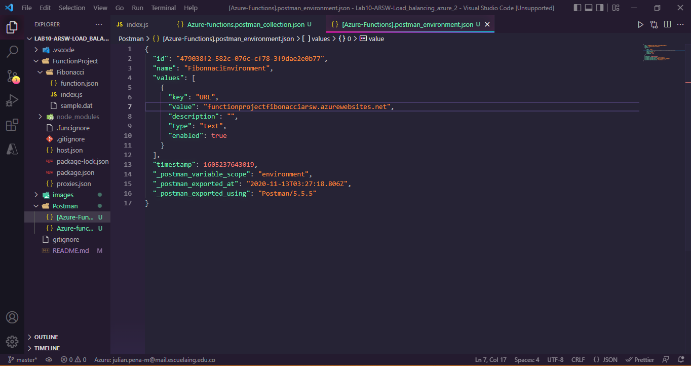
  
* Como resultado se obtuvo lo siguiente

  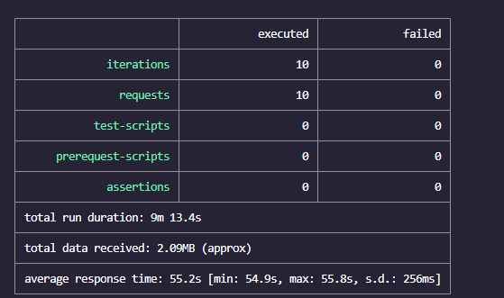
  
  * Por medio de Application Insights se puede observar los resultados obtenidos en azure, midiendo el rendimiento, el tiempo de respuesta del servidor, las solicitudes del servidor, si hubo alguna solicitud que fallo o varias.
  
  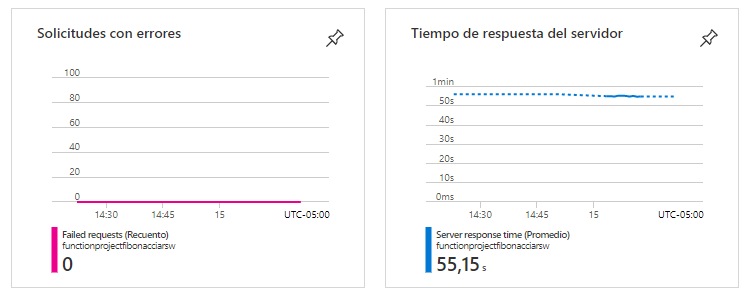
  
  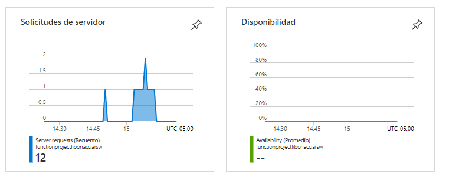

6. Cree una nueva Function que resuleva el problema de Fibonacci pero esta vez utilice un enfoque recursivo con memoization. Pruebe la función varias veces, después no haga nada por al menos 5 minutos. Pruebe la función de nuevo con los valores anteriores. ¿Cuál es el comportamiento?.

* Implementacion con memorización

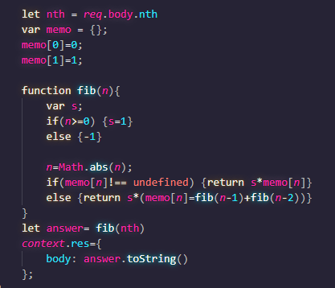

* Se realizaron 3 pruebas, despues de la implementacion del problema de Fibonacci utilizando memorizacion

  * La primera prueba se hizo con el numero 1000, obteniendo los siguientes resultados
  
  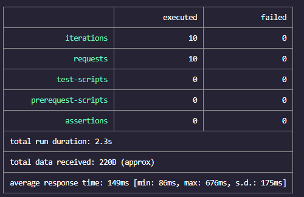
  
  * La segunda prueba se hizo con el numero 10000, obteniendo los siguientes resultados
  
  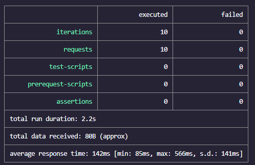
  
  * La tercera prueba se hizo con el numero 1000000, obteniendo los siguientes resultados
  
  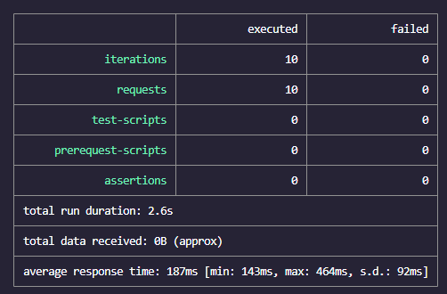
  
  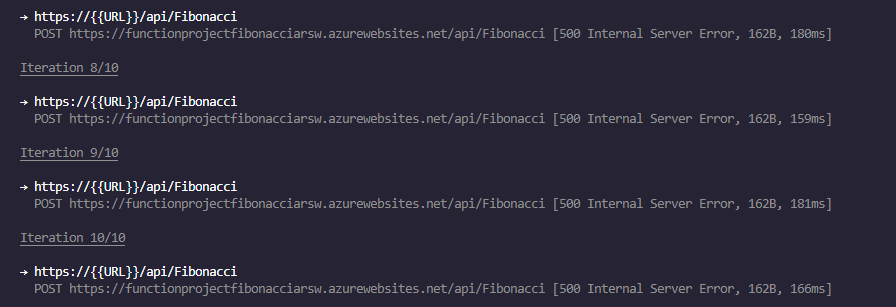
  
  Despues se espero un tiempo de 5 minutos y se volvieron a realizar las mismas pruebas con los mismos numeros obteniendo los siguientes resultados
  
  * Con 1000
  
  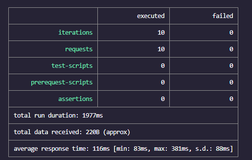
  
  * Con 10000
  
  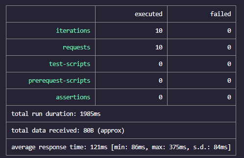
  
  * Con 1000000
  
  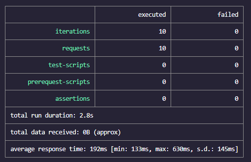
  
  
  
  * Conclusión
  
  Para concluir se puede observar que implementando la memorizacion para resolver fibonacci,se nota una gran reduccion de tiempo, ademas tambien se puede observar que despues de 
  la espera de 5 minutos el tiempo total y promedio de las ejecuciones bajaron aun mas. Tambien se puede observar que cuando se probo con un numero muy grande como lo es con
  el numero 1000000, todas las peticiones fallaron debido a los limites de la recursión.

**Preguntas**

* ¿Qué es un Azure Function?
* ¿Qué es serverless?
* ¿Qué es el runtime y que implica seleccionarlo al momento de crear el Function App?
* ¿Por qué es necesario crear un Storage Account de la mano de un Function App?
* ¿Cuáles son los tipos de planes para un Function App?, ¿En qué se diferencias?, mencione ventajas y desventajas de cada uno de ellos.
* ¿Por qué la memoization falla o no funciona de forma correcta?
* ¿Cómo funciona el sistema de facturación de las Function App?
* Informe
