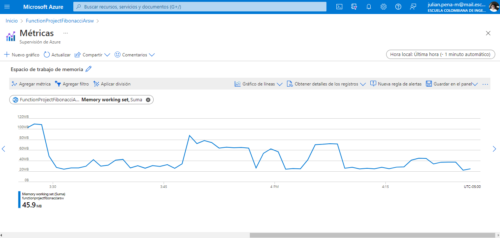
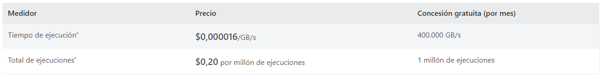
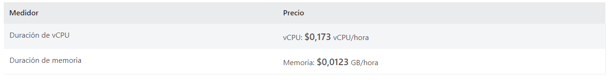

### Escuela Colombiana de Ingeniería
### Arquitecturas de Software - ARSW

## Escalamiento en Azure con Maquinas Virtuales, Sacale Sets y Service Plans

### Dependencias
* Cree una cuenta gratuita dentro de Azure. Para hacerlo puede guiarse de esta [documentación](https://azure.microsoft.com/es-es/free/students/). Al hacerlo usted contará con $100 USD para gastar durante 12 meses.
Antes de iniciar con el laboratorio, revise la siguiente documentación sobre las [Azure Functions](https://www.c-sharpcorner.com/article/an-overview-of-azure-functions/)

### Parte 0 - Entendiendo el escenario de calidad

Adjunto a este laboratorio usted podrá encontrar una aplicación totalmente desarrollada que tiene como objetivo calcular el enésimo valor de la secuencia de Fibonnaci.

**Escalabilidad**
Cuando un conjunto de usuarios consulta un enésimo número (superior a 1000000) de la secuencia de Fibonacci de forma concurrente y el sistema se encuentra bajo condiciones normales de operación, todas las peticiones deben ser respondidas y el consumo de CPU del sistema no puede superar el 70%.

### Escalabilidad Serverless (Functions)

1. Cree una Function App tal cual como se muestra en las  imagenes.

* Creacion de la Function App en Azure

2. Instale la extensión de **Azure Functions** para Visual Studio Code.

* Se instala Azure Functions en Visual Studio Code

3. Despliegue la Function de Fibonacci a Azure usando Visual Studio Code. La primera vez que lo haga se le va a pedir autenticarse, siga las instrucciones.

* Se realiza el despliegue

4. Dirijase al portal de Azure y pruebe la function.

* Se verifica el correcto despliegue en azure y el consumo de memoria

5. Modifique la coleción de POSTMAN con NEWMAN de tal forma que pueda enviar 10 peticiones concurrentes. Verifique los resultados y presente un informe.

* Se modifico la coleccion de postman, de tal manera de que se pueda enviar 10 peticiones concurrentes para hacer la prueba. Quedo de la siguiente forma

  * Functions Collection
  
  
  
  * Functions Enviroment
  
  
  
* Como resultado se obtuvo lo siguiente

  
  
  * Por medio de Application Insights se puede observar los resultados obtenidos en azure, midiendo el rendimiento, el tiempo de respuesta del servidor, las solicitudes del servidor, si hubo alguna solicitud que fallo o varias.
  
  
  
  

6. Cree una nueva Function que resuleva el problema de Fibonacci pero esta vez utilice un enfoque recursivo con memoization. Pruebe la función varias veces, después no haga nada por al menos 5 minutos. Pruebe la función de nuevo con los valores anteriores. ¿Cuál es el comportamiento?.

* Implementacion con memorización

* Se realizaron 3 pruebas, despues de la implementacion del problema de Fibonacci utilizando memorizacion

  * La primera prueba se hizo con el numero 1000, obteniendo los siguientes resultados
  
  
  
  * La segunda prueba se hizo con el numero 10000, obteniendo los siguientes resultados
  
  
  
  * La tercera prueba se hizo con el numero 1000000, obteniendo los siguientes resultados
  
  
  
  
  
  Despues se espero un tiempo de 5 minutos y se volvieron a realizar las mismas pruebas con los mismos numeros obteniendo los siguientes resultados
  
  * Con 1000
  
  
  
  * Con 10000
  
  
  
  * Con 1000000
  
  
  
  
  
  * Consumo de memoria de la funcion, despues de implementarla con memorizacion
  
  
  
  * Conclusión
  
    Para concluir se puede observar que implementando la memorizacion para resolver fibonacci,se nota una gran reduccion de tiempo, ademas tambien se puede observar que despues de 
    la espera de 5 minutos el tiempo total y promedio de las ejecuciones bajaron aun mas. Tambien se puede observar que cuando se probo con un numero muy grande como lo es con
    el numero 1000000, todas las peticiones fallaron debido a los limites de la recursión.

**Preguntas**

* ¿Qué es un Azure Function?

   Azure Functions es un servicio en la nube disponible bajo demanda que proporciona toda la infraestructura y los recursos continuamente actualizados necesarios para ejecutar sus aplicaciones. Usted se concentra en los fragmentos de código que más le importan y Functions se encarga del resto. Functions proporciona procesamiento sin servidor para Azure. Puede usar Funciones para crear API web, responder a cambios en la base de datos, procesar transmisiones de IoT, administrar colas de mensajes y más.
  
* ¿Qué es serverless?

   La computación sin servidor (o serverless para abreviar) es un modelo de ejecución en el que el proveedor en la nube (AWS, Azure o Google Cloud) es responsable de ejecutar un fragmento de código mediante la asignación dinámica de los recursos. Y cobrando solo por la cantidad de recursos utilizados para ejecutar el código. El código, generalmente, se ejecuta dentro de contenedores sin estado que pueden ser activados por una variedad de eventos que incluyen solicitudes HTTP, eventos de base de datos, servicios de colas, alertas de monitoreo, carga de archivos, eventos programados (trabajos cron), etc. El código que se envía a al proveedor en la nube para la ejecución es generalmente en forma de una función. Por lo tanto, serverless a veces se denomina “Funciones como servicio” o “FaaS”.
   
* ¿Qué es el runtime y que implica seleccionarlo al momento de crear el Function App?

   Un runtime environment carga todas las aplicaciones de un programa y las ejecuta en una plataforma. Esta plataforma pone a disposición todos los recursos necesarios para ejecutar el programa independientemente del sistema operativo.
   
* ¿Por qué es necesario crear un Storage Account de la mano de un Function App?

   Es necesario para las operaciones de almacenamiento y administracion de las Function App, ademas proporciona un espacio de nombres único para sus datos de Azure Storage al que se puede acceder desde cualquier parte del mundo a través de HTTP o HTTPS. Los datos de su cuenta de almacenamiento son duraderos y de alta disponibilidad, seguros y enormemente escalables.
   
* ¿Cuáles son los tipos de planes para un Function App?, ¿En qué se diferencias?, mencione ventajas y desventajas de cada uno de ellos.

  * Plan de Consumo
  
    Escale automáticamente y pague solo por los recursos informáticos cuando sus funciones se estén ejecutando.
    En el plan de consumo, las instancias del host Functions se agregan y eliminan dinámicamente en función del número de eventos entrantes.

    * Plan de alojamiento predeterminado.
    * Pague solo cuando sus funciones se estén ejecutando.
    * Escala automáticamente, incluso durante períodos de alta carga.
	
 * Plan Premium
   
   Se escala automáticamente en función de la demanda mediante trabajadores precalentados que ejecutan aplicaciones sin demora después de estar inactivas, se ejecutan en instancias más potentes y se conectan a redes virtuales.
   Considere el plan De Azure Functions Premium en las siguientes situaciones:

	* Las aplicaciones de función se ejecutan de forma continua o casi continua.
	* Tiene un alto número de ejecuciones pequeñas y una factura de ejecución alta, pero pocos segundos de GB en el plan de consumo.
	* Necesita más opciones de CPU o memoria que las proporcionadas por el plan de consumo.
	* El código debe ejecutarse más tiempo que el tiempo máximo de ejecución permitido en el plan de consumo.
	* Necesita características que no están disponibles en el plan consumo, como la conectividad de red virtual.
	* Desea proporcionar una imagen personalizada de Linux en la que ejecutar sus funciones.

 * Plan Dedicado
   
   Ejecute las funciones dentro de un plan del Servicio de aplicaciones a las tarifas normales del plan del Servicio de aplicaciones.
   Ideal para escenarios de larga duración en los que no se pueden usar funciones duraderas. Considere un plan del Servicio de aplicaciones en las siguientes situaciones:

	* Tiene máquinas virtuales existentes y subutilizadas que ya están ejecutando otras instancias del Servicio de aplicaciones.
	* Se requiere escalado predictivo y costos.

* ¿Por qué la memoization falla o no funciona de forma correcta?
  
  Como se menciona arriba en las pruebas, la memorizacion falla cuando el numero es muy grande, esto hace que al intentar calcular fibonacci de un numero muy grande
  se consuma toda la memoria generando una falla o un funcionamiento no esperado.
  
* ¿Cómo funciona el sistema de facturación de las Function App?
  
  * Plan consumo
  
    El plan de consumo de Azure Functions se factura en función del consumo de recursos y las ejecuciones por segundo. Los precios del plan de consumo incluyen una concesión gratuita mensual de 1 millones de solicitudes y 400.000 GB-segundos de consumo de recursos por suscripción en el modelo de precios de pago por uso, para todas las aplicaciones de funciones de esa suscripción. El plan Azure Functions Premium proporciona un rendimiento mejorado y se factura por segundo en función del número de vCPU/s y de GB/s que consuman sus funciones premium. Los clientes también puede ejecutar Functions dentro de su plan de App Service a las tarifas normales del plan de App Service.
	
	
	
 * Plan Premium
   
   La facturación del plan Prémium se basa en el número de núcleos por segundo y en la memoria asignada en todas las instancias. No hay ningún cargo por la ejecución con el plan Prémium. Debe haber al menos una instancia asignada en todo momento en cada plan.
   Cuando cree o escale un plan, podrá elegir entre tres tamaños de instancia. Se le facturará la cantidad total de memoria y núcleos aprovisionados, por los segundos que tenga asignada cada instancia. La aplicación puede escalarse horizontalmente de forma automática a varias instancias cuando sea necesario.
   
   
   
* Informe
